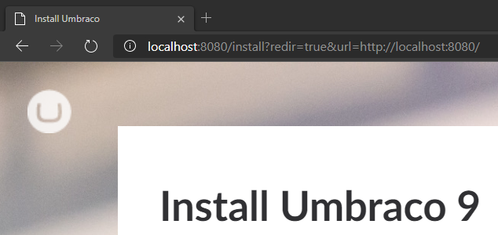
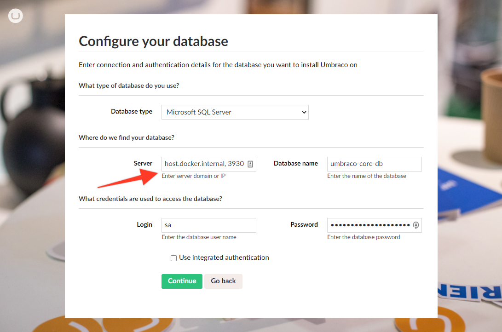

# [Umbraco 9 (.NET Core) Docker Example](https://github.com/thecogworks/umbraco-core-docker-example) &middot; [](../LICENSE.md)

An example project with pre-configured Docker container to run and test the latest Umbraco build.


## Installation & Usage

1. [Download Docker](https://docs.docker.com/get-docker/) and install it if you don't have it on your machine yet.

2. Set up/change the password for the SA database user specified in _configs/ms.sql.env_ file.

```bash
SA_PASSWORD=examplepasswordtodb
ACCEPT_EULA=Y
```

3. Run the following commands in the directory with _docker-compose.yml_:

> Build and run all the configured services:

```cmd
> docker-compose up -d
```

> Dedicated service composition (e.g. just Umbraco project named _umbraco-netcore_ in this demo):

```cmd
> docker-compose up -d umbraco-netcore
```

4. Configure the database on the created MSSQL server instance by connecting to it using e.g. SQL Management Studio or Azure Data Studio.

5. After successfull build (it may take a while at the first time!) and database creation, visit: _localhost:8080_ (default configuration) and continue with Umbraco installation (same as usual).



6. The host has a changing IP address (or none if you have no network access). Use the special DNS name _host.docker.internal_ which resolves to the internal IP address used by the host. **This is for development purpose and will not work in a production environment outside of Docker Desktop for Windows.**



## Known issues

- Missing dictionary items / translations after starting the Docker container

## Resources:

[.NET Core Alpha Release](https://umbraco.com/blog/net-core-alpha-release/)

[Umbraco, Docker and Kubernetes - Should We Care?](https://skrift.io/issues/umbraco-docker-and-kubernetes-should-we-care/)